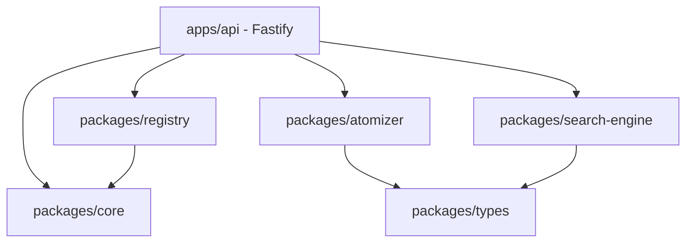

# EGOS System Map

> Mapa de Arquitetura do EGOS (Adaptive Atomic Retrieval)

## Topologia do Monorepo

## Fluxo de Ingestão
1. Recebe payload via `/ingest`.
2. Valida com Zod.
3. `Atomizer` quebra o conteúdo em `Atoms`.
4. `SearchEngine` indexa os `Atoms`.
